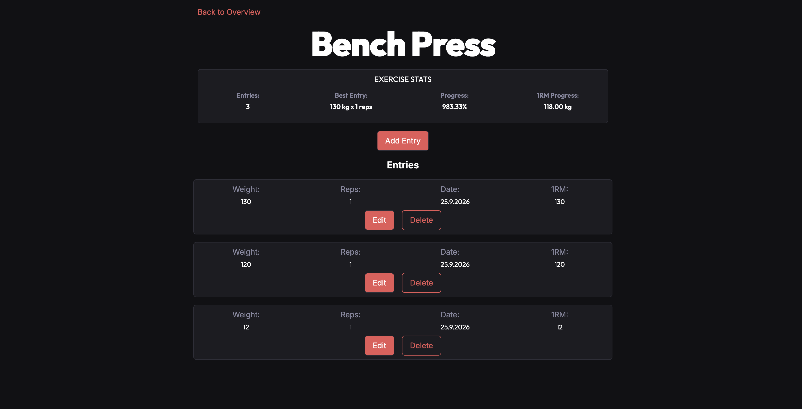
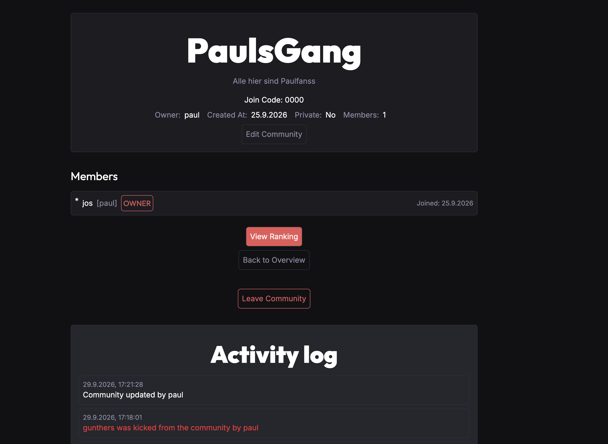
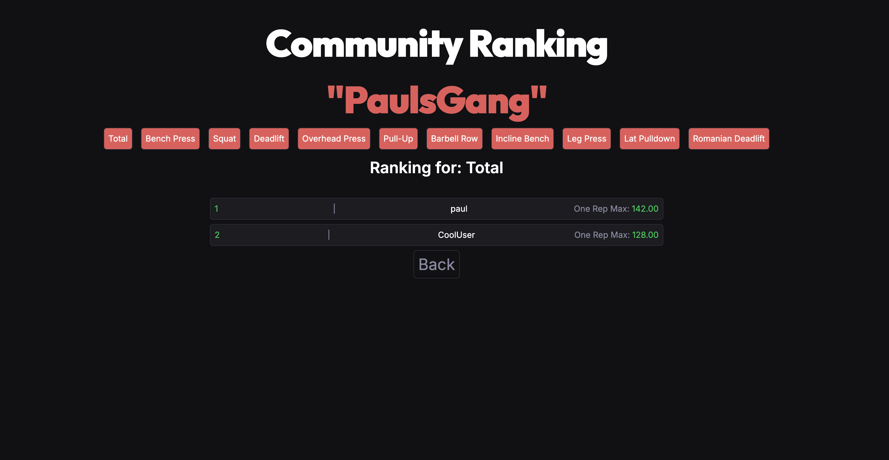

# GymLeague

GymLeague, also referred to as Gym Progress League, is a full-stack learning and portfolio project for tracking strength-training progress and comparing estimated performance within exercise-focused communities.

Users can record weighted exercise sets, review their progress, create or join communities, and view rankings based on estimated one-repetition maximums.

The visual design is intentionally simple, as the main focus of the project was building and structuring a Spring Boot backend.

> GymLeague is an educational project. It is not intended to handle sensitive real-world user data or provide production-grade availability.

## Learning

Working on this project helped me get started with Spring Boot and improve my understanding of REST APIs, authentication, server-side sessions, CSRF protection, JPA, and backend project structure.

It also deepened my knowledge of React, TypeScript, frontend routing, API service layers, and full-stack web development in general.

If I started this project again from scratch, I would plan the architecture more carefully beforehand, define clearer API contracts earlier, and introduce tests and database migrations sooner.

## Features

- Account registration and session-based login
- Personal display-name settings
- Exercise entry tracking with weight, repetitions, and timestamps
- Entry editing and deletion
- Estimated one-repetition maximum calculations
- Best-entry and progress summaries
- Public and private communities
- Public-community discovery and joining
- Join-code based access for private communities
- Configurable exercises for each community
- Community membership and ownership transfer
- Owner-managed member roles, promotions, demotions, and removal
- Per-exercise and combined community rankings
- Recent community activity feed

The application currently includes a predefined catalog of ten exercises.

## Tech Stack

### Frontend

- React 19
- TypeScript
- Vite
- React Router
- Tailwind CSS

### Backend

- Java 21
- Spring Boot
- Spring MVC
- Spring Security
- Spring Data JPA
- Jakarta Validation
- Maven
- Lombok

### Database and Tooling

- PostgreSQL
- Docker and Docker Compose
- GitHub Actions
- GitHub Pages

## Architecture

```text
React + Vite SPA
        |
        | HTTPS, credentialed CORS requests
        | session cookie and CSRF token
        v
Spring Boot REST API
        |
        | Spring Data JPA
        v
PostgreSQL
```

The React frontend and Spring Boot API are designed to be hosted separately.

The frontend is a single-page application with protected client-side routes and a small authentication context. API calls are organized into user, exercise, entry, and community service modules.

The backend follows a controller-service-repository structure with validated request DTOs, response DTOs, centralized exception handling, and JPA entities.

Authentication uses a server-side HTTP session and a `JSESSIONID` cookie rather than JWTs. State-changing requests are protected with Spring Security CSRF tokens. The frontend retrieves a CSRF token from the API and sends it in the `X-XSRF-TOKEN` header. Credentialed CORS is used because the frontend and API are hosted separately.

## Progress and Rankings

GymLeague estimates one-repetition maximum using the Epley formula:

```text
estimated 1RM = weight × (1 + repetitions / 30)
```

Sets above 12 repetitions are excluded from best-entry and ranking calculations.

Exercise progress compares the oldest and newest valid entries. Community rankings can be viewed for each configured exercise or as a combined total across all exercises in the community.

## Community Model

A community has an owner, a privacy setting, a join code, members, and a configurable set of exercises.

Available member roles are:

- Owner
- Admin
- Moderator
- User

Community owners can edit the community, remove members, and promote or demote users. If an owner leaves a community with other members, ownership is transferred. The application also records recent membership and role-management activity.

## Hosting

The frontend is intended to be hosted publicly at:

[https://gymleague.paulbankl.dev](https://gymleague.paulbankl.dev)

The backend API is intended to run separately at:

[https://api.gymleague.paulbankl.dev](https://api.gymleague.paulbankl.dev)

The frontend is deployed through GitHub Pages. The backend is designed to run separately as a Spring Boot API backed by PostgreSQL.

This repository contains the application source code and supporting development files, but it is not intended to serve as a complete self-hosting or production deployment guide. Production infrastructure, secrets, and server-specific configuration are intentionally not documented here.

## Project Structure

```text
.
|-- backend/                 Spring Boot REST API
|   |-- src/main/java/       Controllers, services, repositories, DTOs, and entities
|   |-- src/main/resources/  Spring configuration and reference exercise data
|   `-- Dockerfile
|-- frontend/                React and TypeScript SPA
|   |-- screenshots/         Project screenshots
|   `-- src/                 Pages, components, context, services, and types
|-- .github/workflows/       Frontend deployment workflow
|-- docker-compose.yml       Local PostgreSQL service
`-- .env.example             Example local environment variables
```

## Limitations

- Limited automated test coverage
- No frontend test suite yet
- No email verification or password-reset flow
- No rate limiting
- No production monitoring or backup strategy included in this repository
- Database schema changes currently rely on Hibernate schema updates instead of versioned migrations
- The project is primarily intended as a learning and portfolio project, not as a production-ready fitness platform

## Planned Improvements

- Add backend service, controller, authorization, and security tests
- Add frontend component and end-to-end tests
- Introduce versioned database migrations
- Improve user-facing error handling
- Add production health checks and basic operational documentation
- Review accessibility and responsive behavior
- Improve the visual design and responsiveness of the frontend
- Expand the community role system with clearer permissions

## Screenshots

### Add Entry



### Community Detail



### Ranking



## Check Out the Project

You can find the hosted project here:

[https://gymleague.paulbankl.dev](https://gymleague.paulbankl.dev)
